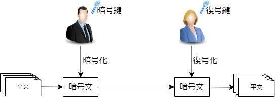
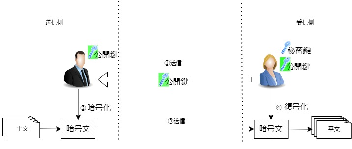
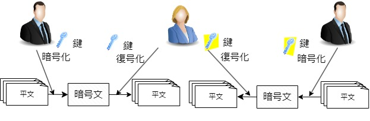

# 暗号技術🗝

## 1　共通鍵暗号方式と公開鍵暗号方式
　暗号化の基本はこれ！暗号鍵で平文を暗号化し、暗号文を復号鍵で平文に複合する。

> キーワード
>- ハイブリッド暗号
>- メッセージダイジェスト
>- メッセージ認証
>- PGP(Pretty Good Privacy)
>- DH(Diffie Hellman)

## 2　公開鍵暗号方式
公開鍵と秘密鍵を使って暗号化するのが、公開鍵暗号方式。公開暗号方式では、暗号化に公開鍵、復号化に秘密鍵を使用する。ゆえに、公開鍵暗号方式は、秘密鍵暗号方式ともいう。

> キーワード
>- RSA(Rivest Shamir Adleman)
>- ECC(Elliptic Curve Cryptography)

上の図を参考に公開鍵暗号方式の具体的な手順を説明する。

>1. 受信者が秘密鍵から公開鍵を作成、送信者に送信。
>2. 送信者が公開鍵を使って暗号化。
>3. 送信者が暗号化した文書を送信。
>4. 受信者が秘密鍵を使って復号し、文書を確認。

公開鍵によって暗号化されたデータは、対になる秘密鍵でしか復号できない。また、その秘密鍵は公開鍵を作成する者のみが保有できる。

## 3　共通鍵暗号方式
共通鍵暗号方式とは、送信者と受信者間で同一の共通鍵を使用して暗号化及び復号化を行う方式。

＊通信する者が増えるほど、鍵の漏洩のリスクが増え、第３者に解読される可能性が高まる。

> キーワード
>- ブロック暗号
>- ストリーム暗号

## 3　デジタル署名

> キーワード
>- DSA(Digital Signature Algorithm)
>- ECDSA(Elliptic Curve Digital Signature Algorithm)